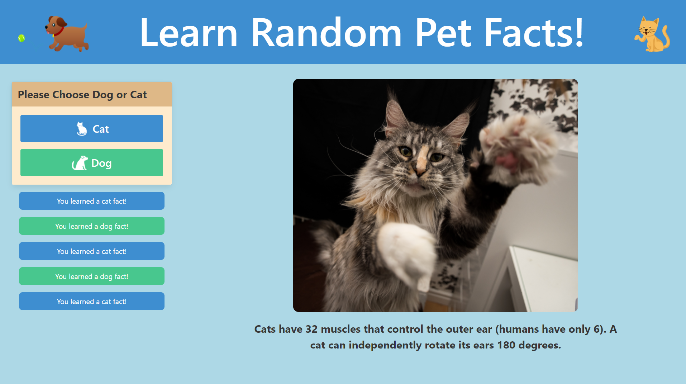

# Pet Fact Generator

## User Story

AS A dog and cat enthusiast\
I WANT to learn random facts about cats and dogs\
SO THAT I have increased knowledge about the pets I love

## Description

This is a random pet fact generator. The user can click either a button labeled "cat" or "dog" to display a corresponding random fact and image about cats or dogs.  The facts and pictures were fetched using several APIs:

- https://catfact.ninja/
- https://dukengn.github.io/Dog-facts-API/
- https://api.thecatapi.com/
- https://api.thedogapi.com

Once a button is clicked the history of clicks are saved into local storage and displayed in list format on the webpage.  

## Languages Used

- HTML
- CSS
- JavaScript

## Third-Party APIs Used

- Bulma

## Screenshot
   

## Deployment Link

https://uncgirl02.github.io/vaulting-sharks-cat-dog-fact-generator